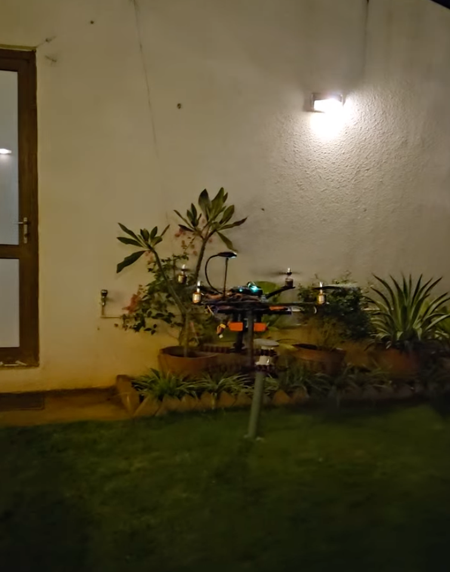
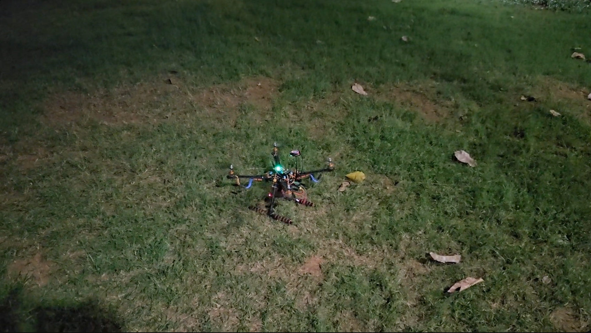
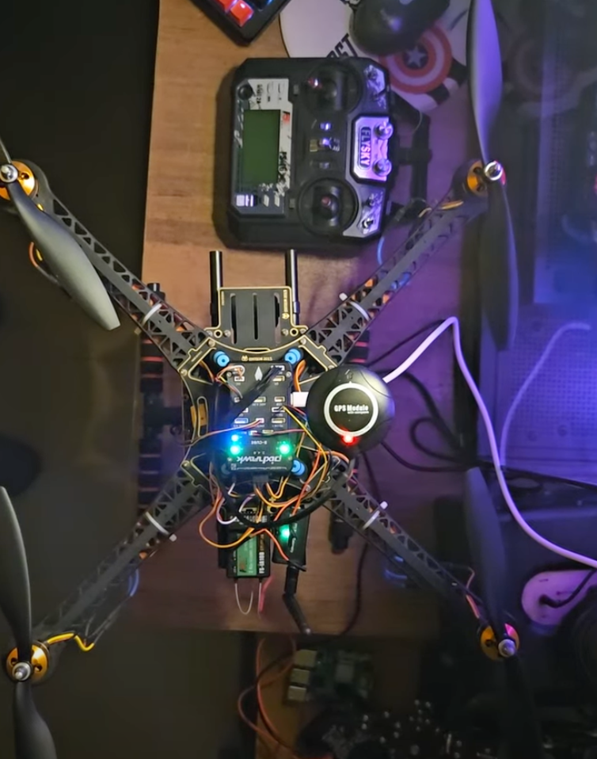

# Thallos  
Drone-Based Microclimate Sensing & Stress Mapping

Thallos is an experimental system that maps fine-scale environmental variation using a compact, drone-mounted sensor payload. Instead of assuming a field is uniform, Thallos measures micro-differences in temperature, humidity, canopy heat, and air composition. These patterns often predict plant stress, soil dryness, and uneven growth long before visible symptoms appear.

Thallos demonstrates that a consumer drone with lightweight sensors and a simple ML pipeline can produce actionable stress maps without specialized agricultural hardware.

### Test Flight (Pre-autonomous Mapping)

---

## System Overview

The drone executes a predefined Mission Planner (ArduPilot) route.  
At each sampling waypoint, the onboard Raspberry Pi records:

- Air temperature  
- Relative humidity  
- Canopy infrared temperature  
- Estimated CO₂ / TVOC  
- RGB frame (optional shading/greenness estimation)  
- GPS coordinates  

Waypoint files (.mission and .kml) are used for later visualization, aligning stress values with the exact flight path.

The drone functions as a mobile microclimate probe, capturing spatially precise snapshots across the target area.

### Autonomous Flight Path Planning
[Autonomous Flight Path Planning](content/autonomousMappingsetup.gif)

### Test Flight (Autonomous Mapping)

---

## Sensor Suite (Prototype)

**DHT11 / SHT31** – Air temperature & humidity  
Used to compute Vapor Pressure Deficit (VPD), a key indicator of atmospheric dryness and crop stress.

- High VPD → more water loss → higher stress  
- Low VPD → cooler, humid environment → lower stress  

**MLX90614** – Infrared canopy temperature  
Warmer canopy typically signals water stress or exposure hot-spots. Early indicator of stomatal closure.

**SGP30** – eCO₂ / TVOC proxy  
Helps differentiate airflow pockets, shaded vegetation zones, and density-driven stress patterns.

**RGB Camera (drone-mounted)**  
Provides contextual cues: shading, basic greenness, structure. Not used for deep vision models.

### Cinematic Drone view

---

## Data Pipeline

1. Drone executes flight mission  
2. Sensors record data at hover points → CSV rows  
3. Features extracted:  
   - VPD  
   - Canopy–air temperature delta  
   - Shade factor  
   - Normalized eCO₂ deviation  
   - Optional greenness score  
4. Microclimate Stress Index (MSI) computed (0–1)  
5. UI plots stress values using Leaflet heatmaps + KML overlay  
   - Red = high stress  
   - Yellow = medium  
   - Green = low  
6. Optional rule-based text insights per location

### Drone top, side and front views
[Drone top](content/topview.png) 
[Drone side](content/sideview.png)
[Drone front](content/frontview.png)

---

## Machine Learning and Data Processing

Thallos processes all environmental data on a backend server after flight. The drone collects raw telemetry while the server handles AI inference and visualization.

Earlier iterations attempted fully onboard processing using the Raspberry Pi 4. However, compute limitations and high power draw significantly reduced flight time. Offloading processing to the server yields faster inference and longer mission endurance.

### Server-Side Prediction Models

#### Air Pollution Prediction
- Detects stagnation pockets and ventilation issues  
- Differentiates pollution-driven stress vs heat-driven stress  
- Useful for shaded or dense vegetation zones where emissions accumulate

#### Temperature + Humidity Forecasting
- Short-term microclimate prediction using time-series models  
- Identifies early-stage stress from high VPD or canopy-air deltas  
- Continuously updates stress conditions before symptoms appear

### Spatial Estimation

- IDW / Kriging interpolation to fill gaps between drone sampling points  
- Generates continuous maps of temperature, humidity, and pollution  
- Supports full-area microclimate analysis rather than point-based observations

### Data Flow Architecture

1. Drone collects sensor data at each waypoint  
2. Telemetry is transmitted to the server after capture  
3. Server runs prediction and classification models  
4. Updated results pushed to Thallos platform UI in real time

This enables continuous model improvement and richer predictions without modifying drone hardware.

---

## Key Features

- Drone-based microclimate sensing  
- Sensor fusion across heat, humidity, and air composition  
- Microclimate Stress Index for interpretable scoring  
- High-resolution heatmap visualization  
- KML flight-path overlay for spatial context  
- Clustering and interpolation for stress zone detection  
- Low-cost hardware and modular design

---

## Purpose

Thallos serves as a proof-of-concept for high-resolution microclimate mapping using inexpensive components.  
Prototype results show meaningful stress variation in fields, parks, and landscaped environments, enabling insights for:

- Localized irrigation  
- Shade planning  
- Soil and vegetation health monitoring  
- Research and environmental surveying